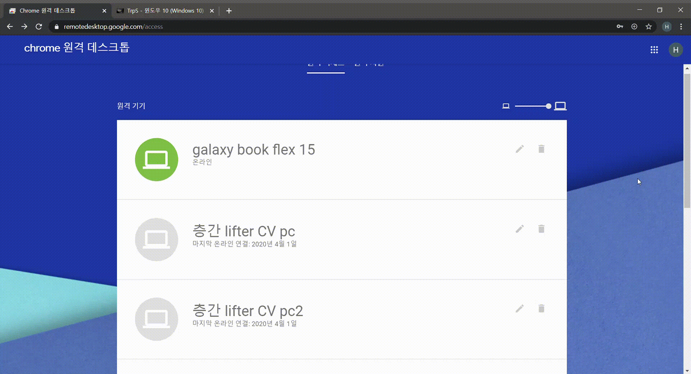
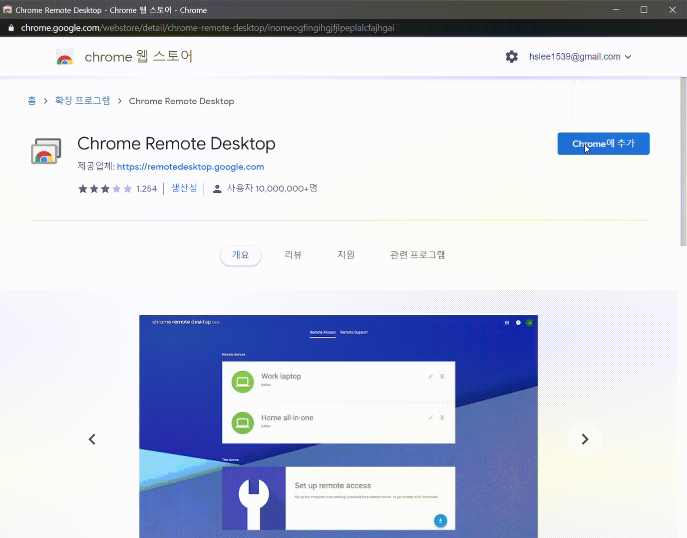
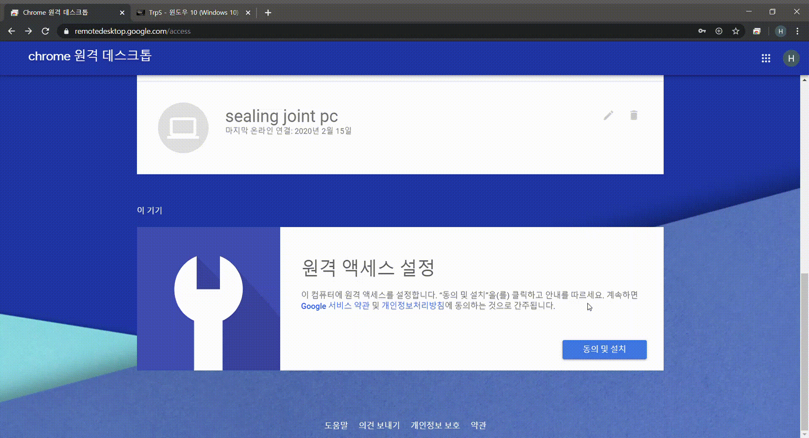
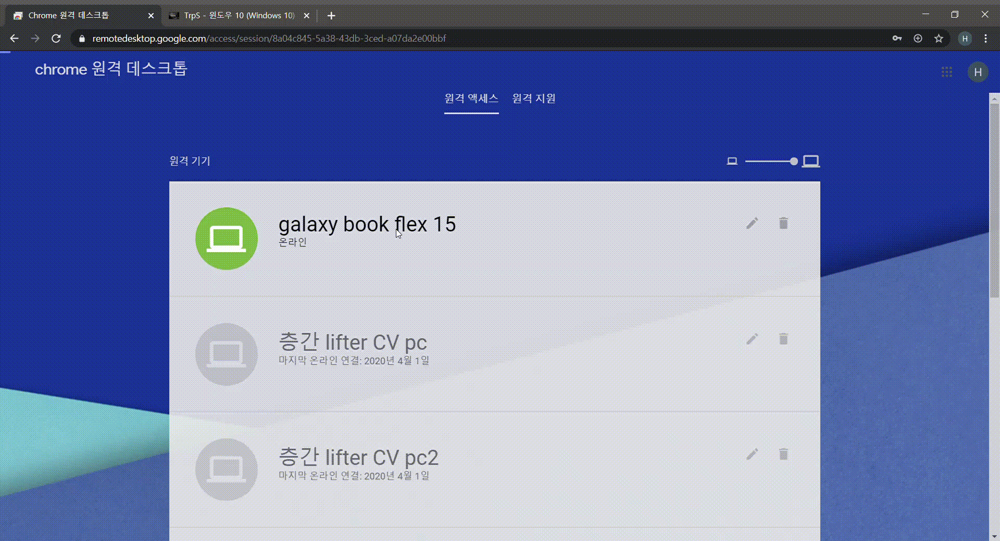

# 크롬 원격 데스크톱 세팅 및 사용법

## 준비물
1. 내 컴퓨터

1. 원격 대상 컴퓨터

## 세팅 방법
1. `내 컴퓨터`와 `원격 대상 컴퓨터`에 [구글 크롬](https://www.google.com/intl/ko/chrome/)을 설치한다.

2. `원격 대상 컴퓨터`에 크롬을 열어 [chrome remote desktop](https://remotedesktop.google.com/access)에 접속한다.

> 동일한 구글 아이디로 로그인이 필수 입니다.

3. [그림1]처럼 하단의 `이 기기`를 찾아 설치 버튼을 클릭한다.

[그림1]

4. [그림2]처럼 새롭게 나타나는 창에서 `chrome에 추가`를 클릭한다.

[그림2]

5. [그림3]처럼 다운로드 된 msi 파일을 설치한다.

> [그림2]를 진행하고 나서 자동으로 다운로드가 됩니다.

[그림3]

6. 이 장치의 이름과 pin 번호를 입력한다.

7. 하단의 `이 기기`에 입력한 이름의 장치가 나오면 성공

## 원격 사용법

1. `내 컴퓨터`에 크롬을 실행한다.
> chromium 계열 브라우저는 다 됩니다. (예, 네이버 웨일, MS chromium edge 등등)

2. `내 컴퓨터`의 크롬에 [chrome remote desktop](https://remotedesktop.google.com/access)에 접속한다.

3. [그림4]처럼 `원격 대상 컴퓨터`를 접속한다

[그림4]

